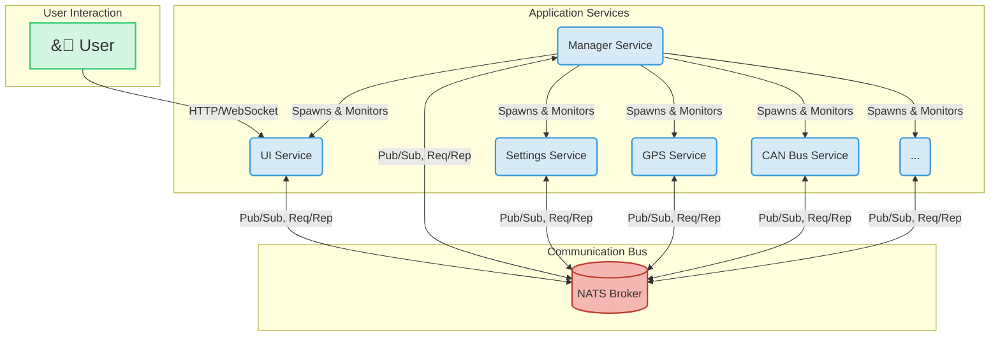
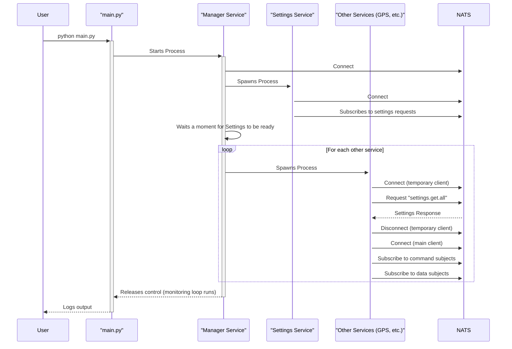

# Application Architecture Overview

This document outlines the high-level architecture of the Python microservice application. The system is designed to be modular, scalable, and resilient, with services communicating asynchronously via a central messaging broker.

## Core Components

-   **Microservices:** The application is broken down into small, independent services. Each service has a single responsibility (e.g., handling GPS data, managing settings, providing a UI).
-   **NATS Messaging Broker:** All communication between services happens via NATS. This decouples the services and allows for flexible data exchange patterns like publish-subscribe and request-reply.
-   **Manager Service:** The central orchestrator. It is responsible for discovering, starting, monitoring, and stopping all other microservices.
-   **UI Service:** The web-based frontend that allows users to interact with the application. It communicates with backend services via NATS over WebSockets.

## Architecture Diagram

The following diagram illustrates the relationship between the core components of the system.

## Startup Sequence

The application is launched via the main `main.py` script, which only starts the **Manager Service**. The Manager then orchestrates the startup of all other services, ensuring the **Settings Service** is available before other services attempt to fetch their configuration.

The sequence diagram below details this process.

