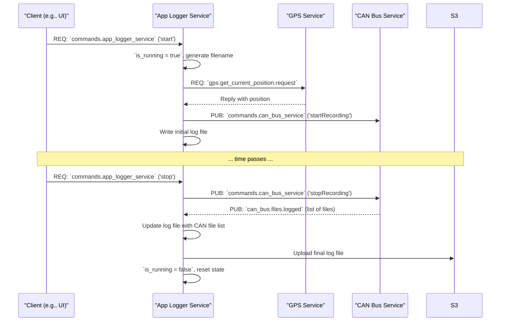

# App Logger Service

## Primary Responsibility

The App Logger Service manages the creation of high-level application logs or "sessions". When a logging session is started, it records the start time, fetches the initial GPS position from the `gps_service`, and commands the `can_bus_service` to start recording raw CAN data.

When the session is stopped, it collects the list of generated CAN log files from the `can_bus_service`, aggregates all this information into a single JSON log file, and uploads the final JSON file to a configured S3 bucket.

## Subscriptions

| Subject                            | Role     | Description                                                                                                | Pattern           |
| ---------------------------------- | -------- | ---------------------------------------------------------------------------------------------------------- | ----------------- |
| `commands.app_logger_service`      | Server   | Listens for `start` and `stop` commands to control logging sessions.                                       | Request/Reply     |
| `app_logger.get_status`            | Server   | Responds to requests for its current status (e.g., whether it's currently running a logging session).      | Request/Reply     |
| `gps.get_current_position.request` | Client   | Requests the current GPS position from the GPS service when a session starts.                              | Request/Reply     |
| `can_bus.files.logged`             | Client   | Subscribes temporarily to get the list of CAN log files from the `can_bus_service` when a session stops.   | Publish/Subscribe |

## Publications

| Subject                  | Description                                                                                                    |
| ------------------------ | -------------------------------------------------------------------------------------------------------------- |
| `app_logger.status`      | Publishes its own status (e.g., `{"isRunning": true}`).                                                        |
| `commands.can_bus_service` | Sends `startRecording` and `stopRecording` commands to the CAN Bus Service to control the raw data logging.    |

## Workflow: A Complete Logging Session

This diagram shows the sequence of events from starting to stopping a logging session.

