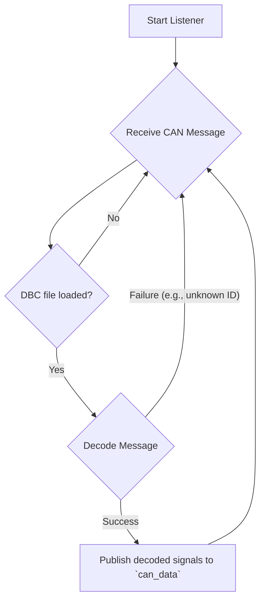
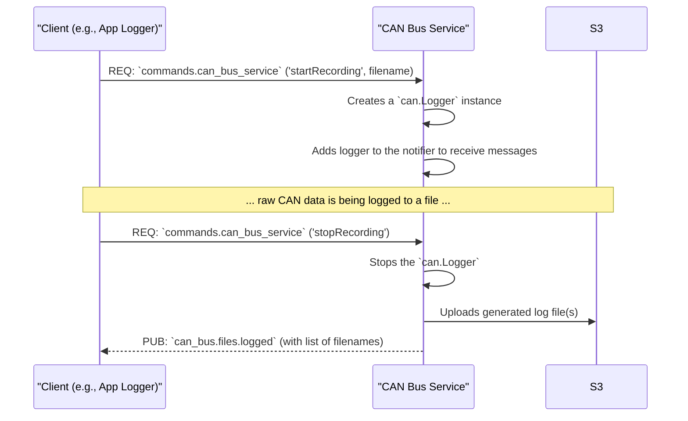

# CAN Bus Service

## Primary Responsibility

The CAN Bus Service interfaces directly with a Controller Area Network (CAN) bus, which can be a physical device (like a CANable) or a virtual one (`vcan`) for development. Its primary responsibilities are:

1.  **Listen and Decode:** It continuously listens for CAN messages on the specified bus. If a `*.dbc` file is provided in the settings, the service uses it to decode the raw CAN messages into meaningful signals (e.g., Engine RPM, Vehicle Speed).
2.  **Publish Data:** Each decoded signal is immediately published as a message on the NATS bus.
3.  **Log Raw Data:** When commanded by another service (like the App Logger), it can record the raw, undecoded CAN traffic to a log file (e.g., in `.blf` format). It supports rotating logs based on file size to manage disk space.
4.  **Upload Logs:** After a recording session is stopped, it automatically uploads the generated log file(s) to a configured S3 bucket.

## Subscriptions

| Subject                    | Description                                                                                                   |
| -------------------------- | ------------------------------------------------------------------------------------------------------------- |
| `commands.can_bus_service` | Listens for `startRecording` and `stopRecording` commands to control the raw data logging functionality.      |

## Publications

| Subject                | Description                                                                                             | Example Payload                                     |
| ---------------------- | ------------------------------------------------------------------------------------------------------- | --------------------------------------------------- |
| `can_data`             | Publishes individual, decoded CAN signals in real-time as they are received.                              | `{"name": "EngineSpeed", "value": 2500.5, "ts": ...}` |
| `can_bus.files.logged` | After a recording session is stopped, this subject is used to publish a list of the log filenames that were generated. | `{"files": ["can_log_20230101_120000.blf"]}`          |

## Workflow: Decoding and Publishing

This diagram shows the continuous process of listening for, decoding, and publishing CAN data.

## Workflow: Recording Session

This sequence shows how the service interacts with a client (like the App Logger Service) to record data.

