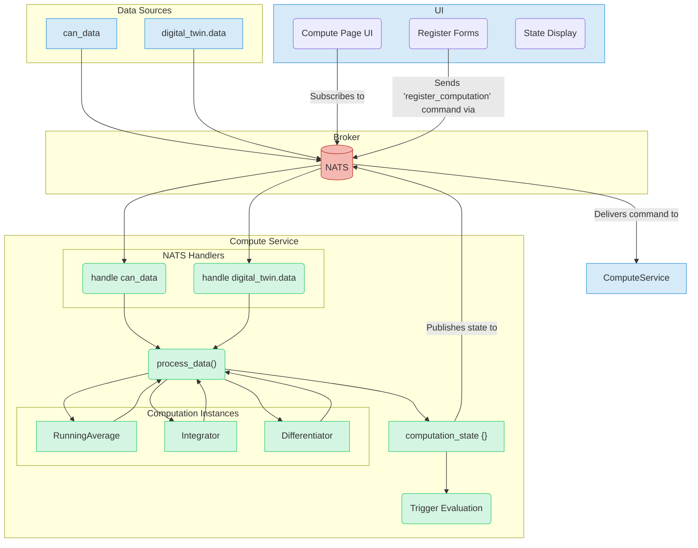

# Compute Service

The `compute_service` is a powerful microservice designed for real-time data processing and analysis. It can subscribe to various data sources (like `can_bus_service` and `digital_twin_service`), perform stateful computations on the data, chain computations together, and trigger actions based on complex conditions.

## Key Features

-   **Dynamic Computations**: Register new computations at runtime.
-   **Chained Logic**: Use the output of one computation as the input for another.
-   **Generic Library**: A library of common stateful computations is provided.
-   **Trigger System**: Define rules to trigger actions when specific data conditions are met.
-   **Real-time UI**: A dedicated web interface to monitor the service and configure computations and triggers.

## Architecture and Data Flow

The service subscribes to NATS subjects for raw data. This data is processed by a series of computation instances. The results are stored in a central state dictionary and can be used by other computations or triggers. The entire state is also published for the UI to consume.



## Generic Computations

The service includes a library of reusable, stateful computation classes in `services/compute_service/computations.py`.

-   **`RunningAverage`**: Calculates the cumulative average of a signal.
-   **`Integrator`**: Computes the time integral of a signal using the trapezoidal rule.
-   **`Differentiator`**: Computes the time derivative of a signal.

## How to Use

### Registering a New Computation

You can register a new computation dynamically using the UI or by sending a NATS command.

-   **Subject**: `commands.compute_service`
-   **Payload**:
    ```json
    {
      "command": "register_computation",
      "args": {
        "source_signal": "can_data.PF_EngineSpeed",
        "computation_type": "RunningAverage",
        "output_name": "EngineSpeed_avg"
      }
    }
    ```
    -   `source_signal`: The name of the input signal. This can be a raw signal from a NATS source (e.g., `can_data.MySignal`) or the output of another computation.
    -   `computation_type`: The class name of the computation to use (e.g., `RunningAverage`).
    -   `output_name`: The name under which the result will be stored and published.

### Registering a Stateful Trigger

Triggers are stateful and can execute different actions based on their state. A trigger has an internal state (`active` or `inactive`) and executes actions when that state changes.

-   **Subject**: `commands.compute_service`
-   **Payload**:
    ```json
    {
      "command": "register_trigger",
      "args": {
        "trigger": {
          "name": "high_temp_alert",
          "conditions": [
            { "name": "oil_temp", "operator": ">", "value": 100 }
          ],
          "action": {
            "on_become_active": {
              "type": "publish",
              "subject": "alerts.temperature.active"
            },
            "on_become_inactive": {
              "type": "publish",
              "subject": "alerts.temperature.inactive"
            }
          }
        }
      }
    }
    ```
-   **`name`**: A unique name for the trigger.
-   **`conditions`**: A list of conditions that must all be true for the trigger to be considered active.
-   **`action`**: A dictionary of actions to perform for different state events.
    -   `on_become_active`: Executed once when the trigger's conditions change from false to true.
    -   `on_become_inactive`: Executed once when the trigger's conditions change from true to false.
    -   `on_is_active`: (Optional) Executed on every evaluation cycle that the trigger remains active.
    -   `on_is_inactive`: (Optional) Executed on every evaluation cycle that the trigger remains inactive.
-   Each action must have a `type`. Currently, only `"publish"` is supported, which requires a NATS `subject` and an optional `payload`.

### Unregistering

You can unregister computations and triggers by sending commands.

-   **Unregister Computation**:
    -   **Command**: `unregister_computation`
    -   **Args**: `{"output_name": "EngineSpeed_avg"}`
-   **Unregister Trigger**:
    -   **Command**: `unregister_trigger`
    -   **Args**: `{"name": "high_temp_alert"}`

### Chaining Computations

Chaining is achieved by using the `output_name` of one computation as the `source_signal` for another.

**Example**: Calculate the derivative of the running average of `PF_EngineSpeed`.

1.  **Register the average computation:**
    ```json
    {
      "command": "register_computation",
      "args": {
        "source_signal": "can_data.PF_EngineSpeed",
        "computation_type": "RunningAverage",
        "output_name": "EngineSpeed_avg"
      }
    }
    ```
2.  **Register the derivative computation:**
    ```json
    {
      "command": "register_computation",
      "args": {
        "source_signal": "EngineSpeed_avg",
        "computation_type": "Differentiator",
        "output_name": "EngineSpeed_acceleration"
      }
    }
    ```

The `compute_service` will automatically route the results.

### Using the UI

The "Compute" page provides a user-friendly interface for all these actions:
-   **Live State**: The right panel shows the real-time status of the service and all values in the `computation_state`.
-   **Register Computation**: The top form on the left allows you to register new computations. The "Input Signal" dropdown is automatically populated with all available signals, including the outputs of other computations, making chaining easy.
-   **Register Trigger**: The bottom form allows you to define new triggers based on the available signals.
