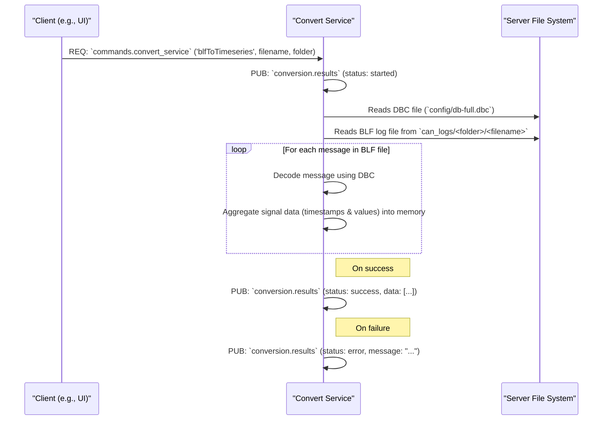

# Convert Service

## Primary Responsibility

The Convert Service is an on-demand utility service responsible for post-processing captured CAN bus data. Its main function is to convert binary CAN log files (e.g., `.blf` format) into a structured, time-series JSON format. It reads a specified log file, decodes all messages within it using a hardcoded DBC file (`config/db-full.dbc`), and aggregates the data for each CAN signal into a list of timestamps and corresponding values.

This service does not run any continuous loops; it only performs work when triggered by a command.

## Subscriptions

| Subject                    | Description                                                                                                   |
| -------------------------- | ------------------------------------------------------------------------------------------------------------- |
| `commands.convert_service` | Listens for the `blfToTimeseries` command, which is the primary trigger for the service's functionality.      |

### Command: `blfToTimeseries`

-   **Arguments:** `filename`, `folder`
-   **Description:** Initiates the conversion process. The service looks for the specified `filename` within the `can_logs/<folder>/` directory.

## Publications

| Subject              | Description                                                                                                                              |
| -------------------- | ---------------------------------------------------------------------------------------------------------------------------------------- |
| `conversion.results` | Publishes the status of the conversion (`started`, `success`, `error`) and, upon successful completion, the final JSON data. The payload for a successful conversion includes the entire time-series dataset. |

## Workflow: File Conversion Process

This diagram illustrates the steps taken by the service when it receives a conversion command.

