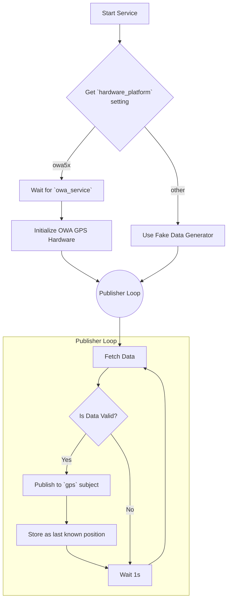

# GPS Service

## Primary Responsibility

The GPS Service provides real-time geolocation data for the application. It is designed with a hardware abstraction layer: it can interface with a specific OWA-brand GPS module or, if the hardware is not present, it can generate simulated GPS data for development and testing purposes. The service periodically publishes the current position and related satellite data in GeoJSON format.

## Hardware Abstraction

The service's behavior depends on the `hardware_platform` setting in `config/settings.json`:

-   If `"hardware_platform": "owa5x"`, the service will attempt to initialize and read from the real GPS module via the `common.owa_*` libraries. It will wait for the `owa_service` to be ready before initializing.
-   For any other value, it will enter a "fake data" mode, generating random but realistic GPS coordinates and satellite information. This is the default for development on a standard PC.

## Subscriptions

| Subject                            | Role     | Description                                                              | Pattern       |
| ---------------------------------- | -------- | ------------------------------------------------------------------------ | ------------- |
| `owa.service.status.request`       | Client   | Requests the status of the `owa_service` to ensure it's ready before use.  | Request/Reply |
| `gps.get_current_position.request` | Server   | Responds to requests with the last known GPS position.                   | Request/Reply |

## Publications

| Subject | Description                                                                                                | Example Payload (GeoJSON)                                                                   |
| ------- | ---------------------------------------------------------------------------------------------------------- | ------------------------------------------------------------------------------------------- |
| `gps`   | Publishes the current GPS position, speed, altitude, and satellite-in-view information at regular intervals. | `{"type": "Feature", "geometry": {"type": "Point", "coordinates": [...]}, "properties": ...}` |

## Internal Logic

The service's main logic runs in a publisher loop that continuously fetches and publishes data. The data source (real or fake) is determined at startup.

