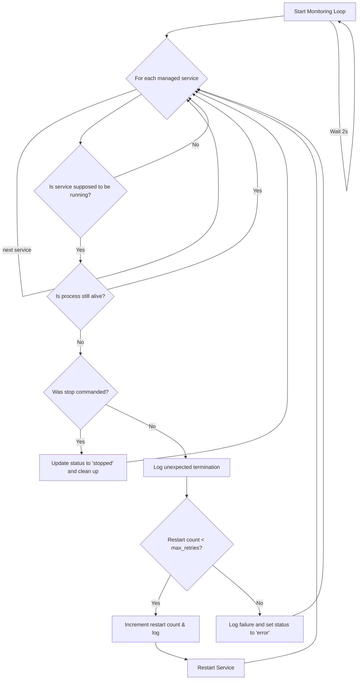

# Manager Service

## Primary Responsibility

The Manager Service is the central orchestrator of the entire application. It is responsible for discovering, starting, stopping, and monitoring the health of all other microservices. It acts as the single entry point for system-wide lifecycle management and is typically the first and only service started manually.

## Subscriptions (Commands)

The Manager service listens for commands on the `commands.manager` NATS subject. The payload for these commands is a JSON object like `{"command": "command_name", "args": [...]}`.

| Command             | Arguments         | Description                                                                  |
| ------------------- | ----------------- | ---------------------------------------------------------------------------- |
| `start_service`     | `service_name`    | Starts a specific, discovered service by name.                               |
| `stop_service`      | `service_name`    | Stops a running service.                                                     |
| `restart_service`   | `service_name`    | Stops and then starts a specific service.                                    |
| `get_status`        | (optional) `reply`| Publishes the status of all services to `manager.status` or a specified reply subject. |
| `start_all`         | None              | Starts all discovered services, beginning with `settings_service`.           |
| `stop_all`          | None              | Stops all currently running services.                                        |
| `restart_all`       | None              | Stops all services and then starts them all again.                           |

## Publications

| Subject          | Description                                                                        | Example Payload                                     |
| ---------------- | ---------------------------------------------------------------------------------- | --------------------------------------------------- |
| `manager.status` | Publishes a comprehensive status of all managed services periodically and on state changes. | `{"global_status": "all_ok", "services": [...]}`    |

## Internal Logic (Monitoring Loop)

The Manager runs a continuous monitoring loop to check the health of the services it has started. If a service process terminates unexpectedly (crashes), the Manager will attempt to restart it a configurable number of times before marking it as an error.

