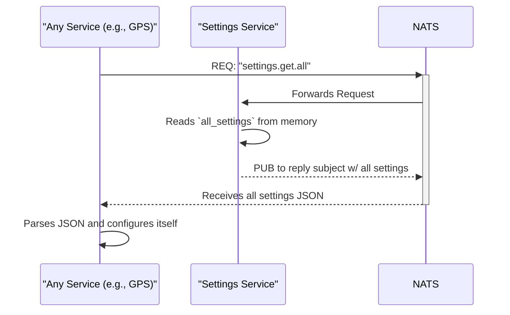
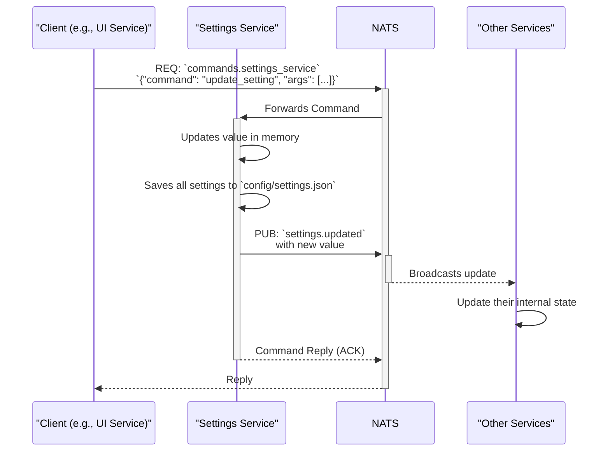

# Settings Service

## Primary Responsibility

The Settings Service acts as the centralized configuration manager for the entire application. It loads all settings from `config/settings.json` at startup. It then serves these settings to other services upon request and handles dynamic updates, persisting them back to the file and broadcasting the changes to all interested services.

## Subscriptions

| Subject                   | Description                                                              | Pattern         |
| ------------------------- | ------------------------------------------------------------------------ | --------------- |
| `settings.get.*`          | Listens for requests from other services for their configuration. The wildcard allows services to request their specific part of the configuration (e.g., `settings.get.gps_service`) or all settings (`settings.get.all`). | Request/Reply   |
| `commands.settings_service` | Listens for commands, specifically `update_setting`, to modify a configuration value. | Request/Reply   |

### Command: `update_setting`

-   **Arguments:** `group`, `key`, `value`
-   **Description:** Updates a specific setting. The `group` typically corresponds to the service name (e.g., "gps_service") or "global". The change is saved to `settings.json` and then broadcast on the `settings.updated` subject.

## Publications

| Subject          | Description                                                                   | Example Payload                                     |
| ---------------- | ----------------------------------------------------------------------------- | --------------------------------------------------- |
| `settings.updated` | Broadcasts a notification to all services when a setting has been changed.    | `{"key": {"group": "gps_service", "value": 2}}` |

## Workflow: Service Retrieving Settings

This sequence diagram shows how a typical service retrieves its configuration from the Settings Service during its startup sequence.

## Workflow: Updating a Setting

This diagram shows how a setting is updated, persisted, and broadcast.

