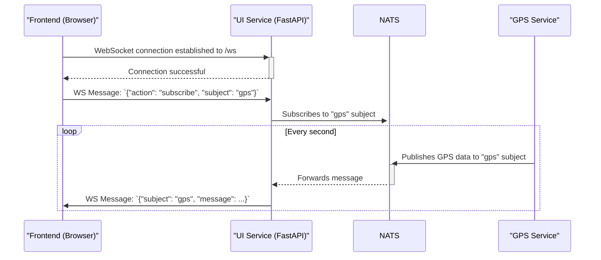
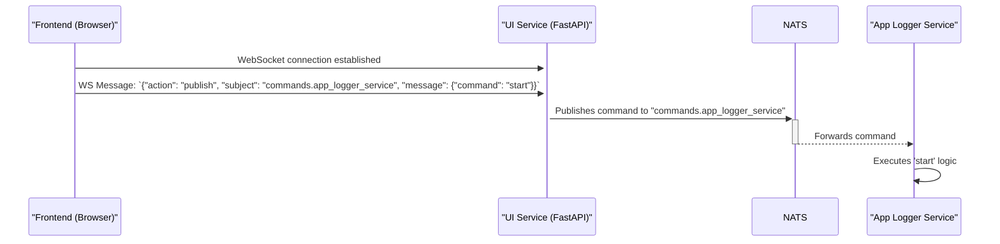

# UI Service

## Primary Responsibility

The UI Service is the web-based frontend for the entire application. It serves the user interface (HTML, CSS, JavaScript) and provides the necessary backend APIs for the frontend to communicate with the rest of the microservice ecosystem. It is built using the FastAPI web framework and acts as the primary point of interaction for the user.

### Key Components

1.  **Web Server:** Serves the main `index.html` page and all associated static assets (CSS, JS, images) that constitute the user interface.
2.  **REST API:** Provides a set of HTTP endpoints under the `/api/` prefix for synchronous actions like listing and downloading log files, reading service logs, and triggering batch conversions.
3.  **WebSocket Gateway:** This is the core of the UI's real-time functionality. It provides a WebSocket endpoint at `/ws` that acts as a secure bridge between the frontend client (in the browser) and the backend NATS messaging system.

## WebSocket Gateway (`/ws`)

The WebSocket connection allows the frontend to interact with the NATS network in real-time without having direct access to the NATS server.

-   **Frontend to Backend (Receiving Messages):** The frontend can send JSON messages to the backend to perform two main actions:
    -   `{"action": "subscribe", "subject": "some.nats.subject"}`: This tells the UI service to subscribe to a specific NATS subject on behalf of the client.
    -   `{"action": "publish", "subject": "commands.some_service", "message": {...}}`: This tells the UI service to publish a message to a NATS subject. This is the primary mechanism for the frontend to send commands to other services.

-   **Backend to Frontend (Sending Messages):** When the UI service receives a message from a NATS subject that the frontend client has subscribed to, it forwards that message over the WebSocket. The message is wrapped in a JSON object that includes the subject it came from, so the frontend knows how to route it: `{"subject": "the.subject", "message": ...}`.

## API Endpoints

-   `GET /`: Serves the main `index.html` page.
-   `GET /api/files/{service_name}/{path}`: Lists files and directories within the specified service's log folder (e.g., `app_logger`, `logger`).
-   `GET /api/file/{service_name}/{filename}`: Reads the content of a specific JSON log file.
-   `GET /api/logs/{service_name}`: Reads the tail end of a service's text log file (`.log`).
-   `GET /api/download/{service_name}/{file_path_b64}`: Provides a file for download. The path is Base64 encoded.
-   `POST /api/convert`: Sends a command to the `convert_service` to process a given log file.

## Workflow: Frontend Receiving Real-Time GPS Data

This diagram shows how the UI can display live data from another service.

## Workflow: Frontend Commanding the App Logger

This diagram shows how the UI can trigger an action in another service.

